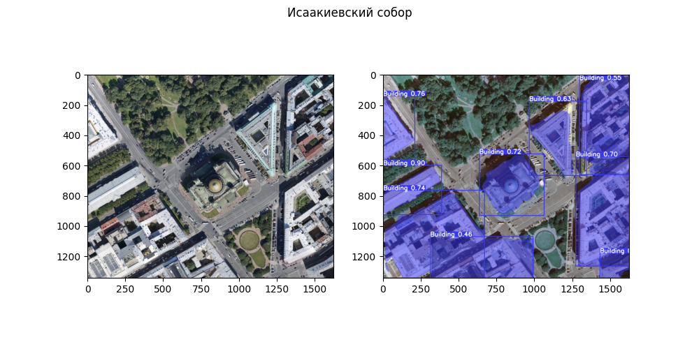
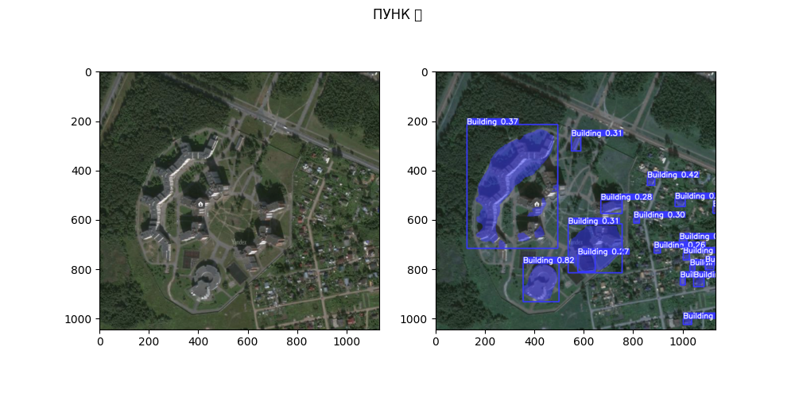
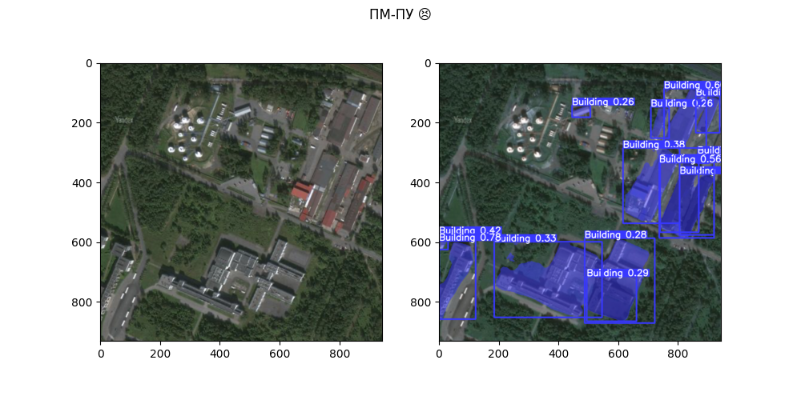

# Instance segmentation

**Model:** YOLOv8n-seg

## Requirements

```bash
pip install ultralytics numpy opencv-python
```

## segmenter.py usage

```python
from segmenter import segment_buildings
buildings = segment_buildings('imagename.jpg') # List[np.ndarray]
```

## YOLOv8seg-n usage

```python
from ultralytics import YOLO
model = YOLO('dronuniver_yolov8nseg.pt')
```

```python
from PIL import Image
img = Image.open(img_name)
res = model(img)[0]
```

## Results




